# Vitrine

This consolidates anything I publish about my current understanding.
Available at [ytrellu.com](https://ytrellu.com).

## Navigating the code

Arrows in the graph mean
"TARGET is assumed, and extended with the property SOURCE".

This infrastucture's goal is the leaf at the end of the
longest chain of the (directed acyclic) graph.

## Next Milestones

TODO Add logging logic to all controls + http requests

TODO Add examples of code viewing tools

TODO Add ToC and contracts with GoDaddy, (Electricity provider), Let's Encrypt
     Portchecktool.com, Ubuntu...

TODO Add secret management
